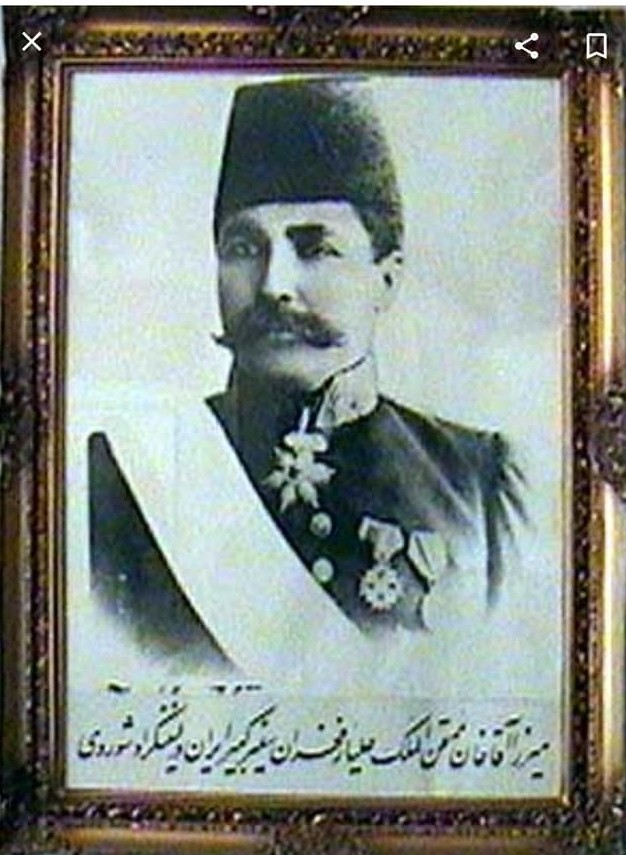

# شرح حال و آثار میرزا آقاخان ممتحن‌الملک علی‌یار فخران

*میرزا آقاخان ممتحن‌الملک علی‌یار فخران — دوران مأموریت دیپلماتیک در روسیه*

---

علی‌یار فخران ملقب به میرزا آقاخان ممتحن‌الملک در سال ۱۲۸۵ هجری قمری در جاجرم (از توابع بجنورد که اکنون شهرستان شده است) دیده به جهان گشودند. تحصیلات ایشان در مدرسه دارالفنون تهران و مدرسه عالی مسلمانان تفلیس بوده است.

ایشان یک دختر و چهار پسر داشتند. فرزند ارشدشان، باقرخان فخران، در مدرسه دارالفنون درس می‌خواندند و در سن بیست و هفت سالگی وفات یافتند. خانم ملکه فخران فرزند باقرخان هستند.

مقامات و مناصب علی‌یار فخران ملقب به میرزا آقاخان ممتحن‌الملک، طبق شجره‌نامه:

شجره‌نامه میرزا آقاخان ممتحن‌الملک

 - دخول در خدمت دولت علیه و نیابت جاجرم (۱۳۰۰) 
 - معاونت نایب‌الحکومه جاجرم (۱۳۰۳) 
 - دریافت مدال علمی (۱۳۰۵) 
 - عضویت در جنرال قونسولگری تفلیس و دفتر اداری آنجا (۱۳۰۸) 
 - آتاشه سفارت پطرزبورغ (۱۳۱۴) 
 - نشان شیر و خورشید (۱۳۱۴) 
 - لقب خانی (۱۳۱۴) 
 - نشان شیر و خورشید مجدد (۱۳۱۵) 
 - نایب سفارت پطرزبورغ (۱۳۱۶) 
 - نشان و حمایل سرهنگی (۱۳۱۸) 
 - نشان درجه سه مجیدی از دولت عثمانی (۱۳۱۸) 
 - نشان درجه سه استانیسلاو از دولت روسیه تزاری (۱۳۱۸) 
 - نشان ایزابل دوکاتولیک از دولت اسپانیا (۱۳۱۹) 

*میرزا آقاخان ممتحن‌الملک — پس از دریافت نشان ایزابل دوکاتولیک از دولت اسپانیا (۱۳۱۹)*

 - قونسولگری باطوم (۱۳۱۹) 
 - کارگزاری قوچان (۱۳۲۳) 
 - قونسولگری باطوم (تاریخ در شجره‌نامه پاره شده بود) 
 - کارگزاری بجنورد (۱۳۲۵) 
 - ریاست عدلیه بجنورد، سوم صفر (۱۳۲۸) 
 - کارگزاری کلات و درگز، ۲۶ شعبان (۱۳۲۹) 
 - قونسولگری قفقاز (۱۳۳۳) 

آخرین مقام ایشان سفیر کبیر ایران در لنینگراد شوروی بود.

*میرزا آقاخان ممتحن‌الملک — تمام‌قد*

*میرزا آقاخان ممتحن‌الملک — دیپلماتیک، دوران مأموریت اروپایی*

*میرزا آقاخان ممتحن‌الملک — در محل خدمت*

*میرزا آقاخان ممتحن‌الملک — پرتره*

## اسامی قدیم و ترجمه جدبه به‌روز 
دخول به معنای ورود به خدمت  
نایب الحکومه معاون فرماندار  
قونسولگری کنسولگری  
آتاشه وابسته نظامی  
نایب سفارت معاون اول سفارت  
کارگزاری فرمانداری و کارگزار به معنای فرماندار  
عدلیه به معنای دادگستری ریاست عدلیه به معنای ریاست دادگستری  
سفیر کبیر نماینده تام الاختیار در کشور مقصد با اختیارات کامل اعلان جنگ و صلح و  امین دولت متبوعه    

## خاطرات

*از چپ به راست: دکتر بهمن فخران، پارس فخران و مریم فخران — فرزندان و نوادگان میرزا آقاخان ممتحن‌الملک*

من بچه بودم. آن زمان داریوش مدیر رستوران اپیکور در تهران بود. او خط بسیار زیبایی داشت، با هر دو دست خطاطی می‌کرد و تابلوهایی می‌کشید که با آثار بزرگانِ این هنر برابری می‌کرد.

یک بار با پدرم به دیدن داریوش رفته بودیم. او از کارگزار چنین تعریف می‌کرد که دیوارهای حیاط را تازه گچ‌کاری و سفید کرده بودند و داریوشِ شیطان و عاشقِ خطاطی، با زغال چیزی روی دیوار می‌نویسد که ناگهان کارگزار سر می‌رسد. داریوش می‌گفت: «چنان گوش مرا تاب داد که از زمین بلند شدم و انگار هنوز هم جایش درد می‌کند!» بعد از آن‌که عتاب و خطابش تمام شد، نگاهی به نوشته‌ی روی دیوار انداخت و گفت: «خط و ربط زیبایی داری!» سپس یک تومان یا سکه قابل‌توجهی به عنوان پاداش به او داد. اخلاقش چنین بود؛ انضباط، تشویق و تنبیه به جای خود.

پدرم تعریف می‌کرد که وقتی سفره می‌انداختند، کارگزار می‌رفت صدر مجلس می‌نشست و از بچه‌ها تک‌تک می‌پرسید: «تو بچه کی هستی؟ بابات کیه؟ جدت کیه؟ چرا اون‌جا نشستی؟ برو دم در، یا برو دو تا پایین‌تر، یا بیا بالاتر!» تا همه را از روی لقب و عنوانِ جد و آبادشان به خط نمی‌کرد، کسی جرئت نداشت شروع به غذا خوردن کند. حالا حساب کنید با نوه خودش و بچه‌های سر سفره‌اش که این‌طور برخورد می‌کرد، در کار چه سخت‌گیری بود. پدرم به کارگزار نرفته، ولی من خودم چرا؛ زبانی تند و نیش‌دار برای کارهای رده‌بالا و حساس به ارث برده‌ام. چه در ایران که مشاور خصوصی نصب و راه‌اندازی کارخانجات، تعمیر و عیب‌یابی خطوط تولید، ماشین‌آلات سی‌ان‌سی (CNC)، کامپیوتر و برق بودم، یا در زمینه‌ی نرم‌افزار و شبکه. چه در آمریکا که در شرکت‌هایی از مورگان استنلی (Morgan Stanley) و ورایزن (Verizon) و اپل (Apple) گرفته تا جنرال الکتریک (General Electric)، پست‌های حساس و معماری شبکه داشتم، که الان اگر بخواهم آن‌ها را بیان کنم باید ترجمه کنم ببینم معادل فارسی‌شان چه می‌شود. البته ببخشید، من نه فارسیِ این اصطلاحات را بلد بودم و نه به دردم می‌خورد، چون این مهارت‌ها را هم به انگلیسی یاد گرفتم و هم کارم را به انگلیسی انجام دادم. 

یادم نمی‌رود، یک کتاب خریدم با عنوان «تقویت‌کننده‌های عملیاتی: بگیر و بکش»! (که منظورشان پوش-پُل بود)، یا کلمه‌ی «الاکلنگی» که برای فلیپ‌فلاپ (Flip-Flop) ترجمه کرده بودند! نمی‌دانستم بخندم یا گریه کنم. عطایش را به لقایش بخشیدم و برای آخر ترم همان رفرنس انگلیسی‌اش را خواندم. 

زبانم هم همیشه خوب و صدالبته دراز بود! وقتی می‌خواستم بیایم آمریکا، کنسول به من گفت: «زبانت هم که خوبه.» گفتم: «می‌دونم درازه! ولی فکر کنم لهجه و تلفظم افتضاح باشه، چون من انگلیسی را با خواندن یاد گرفتم، نه شنیدن و مکالمه.» تمرینم هم فقط با دیکشنری بود. یادش بخیر، عهد بوق یک چیزی بود به اسم دیکشنری که یک‌جور کتابِ ایندکس‌شده بود؛ حالا انگار اصلاً کسی نمی‌داند فرهنگ لغات چیست و...

متاسفانه خاطرات من از این جدّ بزرگوار، به همین چند اسم و فامیل، داستان دختر سوارکار، خطاطی داریوش و به خط کردنِ بروبچه‌ها سر سفره ختم می‌شود.

---

## شجره‌نامه تصویری

*شجره‌نامه و پیوندهای خانوادگی — خاندان فخران*

فخران سرا نام ویلای بهمن جون توی شمال بود که زمین تنیس هم داشت ولی نزدیک آب بود و بالخره اب بردش ولی چون طولش زیاد بود دوباره یکی دیگه دورتر از آب ساخت و نمیدونم الان دست کیه و سرنوشتش چی شد و ویلای جدیدش رو هم ندیدم ولی قبی بسیار دلباز وبود و دو طبقه بود و تراس طبقه بالا مشرف به دریای خزر و شبهای بسیار زیبا و خاطرات قشنگی ازش دارم چه از بهمن جون کلید میگرفتیم که خوب کلیدی در کار نیود میرفتیم به سرایدارد میگفتیم سلام یا ما شمال بودیم و میرفتمی یه سری میزدیم و یه شام و خوش و بش و از صحبتهای بهمن جون لرت میبردیم که میشد پسر عمه بابا به با میگفت ممدجان بابا هم میگفت دادش من هم طبق معمول همیشه برای جون جونی میگفتم بهمن جون که بور بیایی داشت و پزشک مخصوص دربار بود بعد هم دکتر اردبیلی و بقیه دستان بلنداکس موافق هم نبود ولی متخصص قلب بود و به عنوان دکتر براش فرقی نمیکرد و به نفع پارس هم نبود که بخواد با رژیم مستقر دربیافته و من هم خوب میفهمیدم ولی تعارف و رودربایستی هم نداشت و حرفشو بی پرده میزد تشخیصش هم محشر بود.

---

#  کریم خان فخران  
کریم خان فرزند کارگزار بود جاجرم مطب داشت و دکتر بود و من ازش خاطرات جالبی دارم و بسیار خوش مشرب و خوش صحبت بودو بابا هم که دلد دلد کریم خان وخانواد زینت جون همسر کریم خان چون هم همه خان و خان زاده بود اکثر ماها میگفتیم خان ولی خوب مریضها یا از روی لج یا بیضعوری میگفتن آقای دکتر.

دستپخت زینت جون معرککه بود فیروز پسر بزرگه بود و دوست و رفیق فابریک من که هم سن و سال پسر عمه های من بود و شر الواتی به کنار با احمد شب مست با طرف رفته بود باغ یکی گوجه دزدی یه نمک دون هم میبردن که بزنن به گوجه قرمز و سبز و خیار حلا این پسر خان اون واسه خوش کسی خلاصه هر چی زور میزنن نه از در میتونن برن بالا نه بپرن تو باغ احمد هم قاط مینزه زنجیر یمینده به در باغ با حیپ میکشن درو میکنن بعد فردا گندش درمیاد طرفو بردن باغ باباش دزدی حالا چه سوژه ای شده بود بماند طفلی یه ازدواج ناموفق داشتو طرف قاپش زد و فکر کنم توی محذوریت اخلاقی یا عضق پو عاضقی ازدواج کردنو کریم خان و زینت حون طردش کردن مژگان هم سنگ صبور و بابا من و بیشتر باب بابا درددل میکرد ممدحان فیروز ال فیروز بل فقروز رفت مضهد و توی جاده مضهد قوچان توی یکی از همین رفت و آمدهاش تصادف منجربه فوت کرد و جوتانمرگشد مثل برادر بزرگتر بابا که اسب زمینش زد و مرد و بابا دو سال ترک تحصیل کرد و با سرهنگ دادرس ريیس هنگ ژاندارمری مشهد و هنگ بحنورد زمان انقلاب و دکتر استرآبادی داروساز که شد باخناق دای دکتر من که داروساز بود عمو احمد عمه فرزانه رو گرفته بود بابا هم شد باعث بانی خیر فروغ جون رو با دای حور کرد توی ویلاهای بانک کشاورزی سابق و دانشکده علوم بانکمداری اسلامی بانک کشاورزی که بابا شده بود ریسش بعد از انقلاب و آقای کلانی که عمو ولی شده بود ریس ثبت احوال بخنورد و بعد که رفتیم بحنورد تازه من فهمیدم که ابوی گرام ملقب به پیغمبر بوده چون اهل نماز روزه بوده عرق و خانم هم نه با من خبردار نشدم یه سیگاری یه مدت چس دود میکرد به ضرب و زور من یه پیکی هم با من میزد تا از راه به در شد و رفت مکه و گفت من حاجی شدم و خلاص ممدجان ابوی مرد.

علی تع تغاری بود شب که از بیرن میاومد لباساشو توی حیاط درمیآورد جندتا روزنامه برمیداشت میانداخت دم بخاری تا صبح لخت روی زونامه میخوابید تا صبح آبگرمکن رو رون کنن بره حام لباس تمیز بپوشه بیاد تو.

کریم خان هم وسوساس وحشتناک اشت بشور و بمال و بساب یه بار تعریف میکرد رفته بوده ایور یا درق سر زایمان بعد که مآید دستهاشو بشوره بهش صابون که میدن میمونه صابونو کجا بزار میپرسه صابونو کجا بزار طرف هم نه میذارهن نه ورمیداره میگه اوی کو یعنی گاو خو بزار روی سنگ دیه دیگه حالا به لحجه تعریف میکرد ماها از خنده روده بر میشیدم من تخته و شطرنجم اونحا خوب شد از بس همه تخته باز و نراد و شطرنج بود بابا که خجالت میکشید من برای کریم خان کررکری میخوندم میگفت ممدحان این بابمداد از همه فخرانتره مثل باباست هیشکی حریفش نمیشه فث=یروز می اومد میگفت بزار من روی این بچه پر رو رپ کم کنم ممدحان احازه است میگفت فیروز جون به من میگی بچه پرپرو بعد از بابا عذر میخوای میگگفت تو هنوز حوحه ای بایا دو دست مارسی میدادم سه دسات مارسی میگرفتم مژگان میگفت برین بابا کار خودمه مژگان هم خوارم بود مگه میشد ببریش من نمیدونم تاس میگرفت حنبل حادو میکرد من و مژگان انقدر بازی میگردیم ببا حوصله اش سر میرفت میگفت ول کن دختر عموی منو چچه کار دراری پو شام حاضر بود.

:ریم خان تعریف میکرد یه بابایی میره پیشش میگه آقای دکتر مو دلم درد موکونه میگه خوب بگو ببینم چه کار کردی جی خوردی میگه مو رفتم دیدم پسر عمه ام که دختر دختر عمه میگه بابا جان کجا رفتی رو ولش دلت و بگو میگه خوب اقای دکتر نمیذاری خلاصه بالاخره داستان حسن کرد شبستریشو که تموم میکنه کریم خان هم عصبانی میگه مرتیکه اینا چه ربطی به دل درت داره میگم چی خوردی به شکمت ضربه خورده چته لامصب اونم میگه خو من چمیدونم خو تودمتری یا گو ...

حالا حرصاشپوو خورده بود برای ما تعریف میکرد و میخندیدیدم بعد بابا و کریم خان و علی و مژگان وزینت حون ومامان و مریم و علی و من میافتادیم به جوک گفتن منم مگه جوکام تموم میشد فقط ابروردای میگردم جلوی مژگان و زینت جون هجدیه با بالا رو نمیگفتم بابا که همه رو در گوششون میگفت و مژگان غش و ریسه میرفت خلاصه دوران شیرینی بود.

سرهنگ حسن خان سرهنگ حسین خان هم برادرهای کریم خان بودن نماز میخوندن بی وضو میگفتم جناب سرهنگ وضو نمیگیرین میگفت بامداد حان وضو مال پاکیزیگیه من هم همیشه پاکم یه بار قاط زدم پیش کریم خان به سرهنگ حسن خان گفتم یعنی شما هیچ وقتی تو عمرت نگوزیدی حناب سرهنگ یک نه محکمی گفت کریم خان از خنده ترکید گفت بامداد حان سرهنگ حسن خان و سرهنگ حسین خان  کوناشون گوزگیر داره مزگان که نوشابه پرید توی گلوش و از دماغش ریخت بیرونو رینت جون هم خوب بابا راست میگه دیگه. زینت جون هم جوانیهاش سوارکارو شکارجی و اصل و نسب دار بعد هم که بهمن جون می اومد منو بابا یا با فیروز میرفتیم جوین سر باغ و مزرعه بهمن جون یا شکار و گوشت شکار و کلی حان و حولا دوران شیرینی بود همه هم یا فامیل بودن یا ما رو میشناختن فیروز و علی که نوه های کارگزار وبچه های دکتر دهکده منم که بابام شهردار و رییس بانک و یه گله هم پسر عمه داشتم یکی از یکی شرتر و بچه معروفتر. رییس دادگاه حاحرم الان رییس دادگاه انقلابه و دوست فابریک بابا بود.

خواهرشون هم که مامان بابا بود که به مامانم میگفت الهی نصیب گرگبیابون بشی کدوم کور کچل بدبختی میخواد تو رو بگیره من به مامان بزرگام رفتم یکی از یکی کلفت گوتر مامان بابای بابا رو که ندیدم ولی میامان مامان میگفت بامداد گنده میگوید به لفظ قلم شاهروید یا میگفت بامدا صدتا بدی داره یه خوبی یکی دروغ نمیگه یکی قاشق گه خوریش همیشه کمرشه میگفتم ماردون شد دوتا میگفت وخی وخی عموجومن و معدن شرب المثل شاهرودی بود و من هم که طوطی ضرب المثلهای خودشو تحویل خودش میدادم کل فامیل و دوست > آنا هم میدونستم من حال و حوصله چرت و پرت ندارم خیلی ملاحظه کنم دو سه دفعه است و یه چنار میچپونم توی کاسه طرف و حساب دستشون بود هر کی هم نبود یه صابونی به تنش میخور میشد جوک سال فامیل.

بابا میگفت مامن بیچاره ام خبر نداشت کور کچل بدبخت گرگ بیابون ممدک خودشه یه پسر دلدل لوس ننر بعد از دو تا خواهر آب زیر کاه گهی بود واسه خودش من خرم خودم تک پسرم ولی خارشو به عزاش نشوندم ادای کارگزارو برای من درمیآورد نمیدونست خودش فخران الیه من راستکی بهمن جون میگفت ممدجان بابمداد زبونش و ادربیاتش مثل کارگزار خدا بیامرزه و داستان ختم پرد بهمن حون هم داستانی داره که بماند برای بعد.
