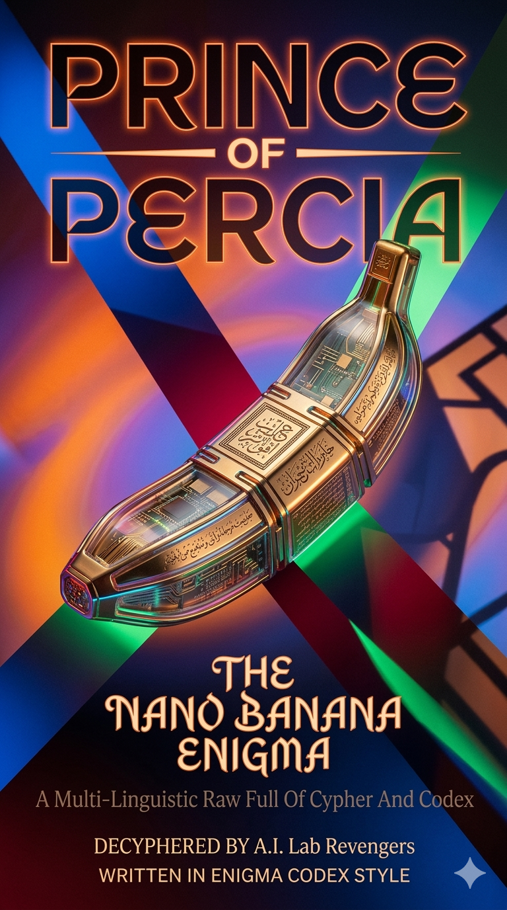

# Book Writing Style

This repository preserves raw multilingual drafts that may contain cipher-like phrasing, mixed tone, and layered context. The editorial goal is to preserve the original signal while publishing readable, audience-aware versions.

## Editorial Principles

1. Preserve the source.
2. Improve readability.
3. Clarify context without flattening the author's voice.
4. Deliver multiple narrative layers for different readers.

## Required Chapter Structure

Each transformed chapter should be published in four sections, in this order:

1. `Index`
	- Clear chapter map
	- Logical thematic grouping

2. `Enigma Codex (Deciphered)`
	- Typo and grammar repair
	- Explicit restoration of implied context
	- Short, faithful interpretation of dense passages

3. `English Mysterious Style`
	- Literary, atmospheric retelling
	- Suitable for architects and advanced technical readers

4. `Fairy Tale Version`
	- Plain-language narrative
	- Suitable for general readers, students, and first-time audiences

## Audience Targets

- Architects and CS practitioners
- Applied AI/ML researchers
- General readers and students

## Quality Checklist

- Is the original context preserved?
- Are typos and grammar corrected?
- Are all four required sections present?
- Is each section clearly labeled?
- Is the result understandable across audience levels?

## Repository Hygiene

- Remove obsolete temporary folders such as `Book.worktrees/` after merge completion.
- Keep chapter files consistent in headings, ordering, and formatting.

---

# Understanding The Prince of Persia (Enigma Edition)

Welcome to a simpler way to read a very complicated book.

The original *Prince of Persia (Enigma Edition)* is filled with strange symbols, complex Persian script, and hidden messages. It's written in a style called the **"Enigma Codex,"** which is almost impossible to read.

To help you, we have organized the book into four clear steps.

---

## The 4-Step Workflow

### 1. Index

This is your roadmap. It lists every chapter in the book.

### 2. Enigma Codex (Deciphered)

This section preserves the difficult source material while making it readable. It includes typo fixes, grammar cleanup, and the contextual clues needed to reveal hidden meaning.

### 3. English Mysterious Style

This version is written in clear English while preserving the magical, cryptic feel of the original.

### 4. Fairy Tale Version

This is the simplest version. It retells the material as a fairy tale and is best suited for new students and general readers.

---

## Transformation Example

The table below shows how one small piece of difficult source material can be transformed across the three narrative layers.

| Version | Example |  
| --- | --- |  
| **Enigma Codex (Deciphered)** | `Chapter 1: The Cypher Key. The passage is extremely difficult to read, understand, debug, and correct.` |  
| **English Mysterious Style** | `A hidden key was found, but it resisted every easy attempt to read, repair, or fully understand it.` |  
| **Fairy Tale Version** | `Once upon a time, people found a secret key so difficult that even wise readers had to work carefully to understand it.` |  